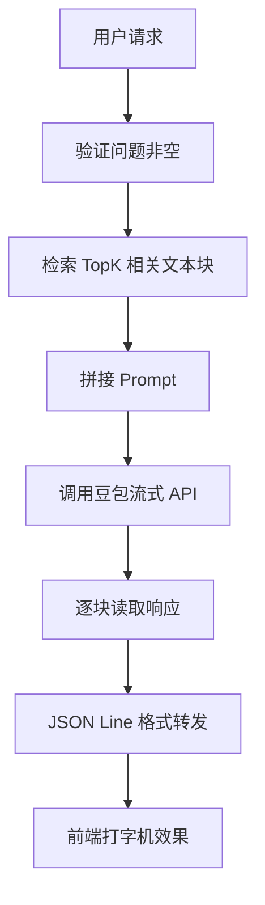

# Step14 Plan: 文档对话流式接口

## 任务目标

实现 `POST /api/chat/stream` 流式对话接口，将豆包 API 的流式响应实时推送

## 流式数据流程




## 实现步骤

### 1. 扩展 LLM 服务 - `src/services/llm.service.ts`

新增流式对话方法：

```typescript
export async function chatCompletionStream(
  prompt: string,
  onChunk: (chunk: string) => void,
  onError: (error: string) => void
): Promise<void>
```

### 2. 创建流式响应工具 - `src/utils/streamResponse.ts`

封装流式响应工具函数：

```typescript
export function setupStreamResponse(
  res: Response,
  onClose?: () => void
): { writeChunk: (chunk: string, finish: boolean) => void }
```

- 设置响应头：Content-Type, Transfer-Encoding, Cache-Control
- 提供 writeChunk 方法输出 JSON Line 格式

### 3. 扩展聊天路由 - `src/routes/chat.route.ts`

新增 `POST /api/chat/stream` 接口：

- 验证问题参数
- 调用检索服务获取上下文
- 调用流式 LLM 服务
- 使用 streamResponse 工具逐块转发

### 4. 创建单元测试 - `src/__tests__/chat.stream.test.ts`

测试用例覆盖：

- TC-STREAM-101: 正常流式对话
- TC-STREAM-105: JSON Line 格式验证
- TC-STREAM-106: finish=true 结束标记
- TC-STREAM-107: 空问题校验
- TC-STREAM-109: API 错误处理

## 响应格式

```json
{"chunk":"你好","finish":false}
{"chunk":"，","finish":false}
{"chunk":"有什么","finish":false}
{"chunk":"可以帮","finish":false}
{"chunk":"你？","finish":true}
```

## 验收标准

- Content-Type 为 `text/event-stream`
- Transfer-Encoding 为 `chunked`
- 每行为独立 JSON，包含 `chunk` 和 `finish` 字段
- 最后一行 `finish: true`
- 客户端断开时正确释放资源
- 所有测试用例通过

