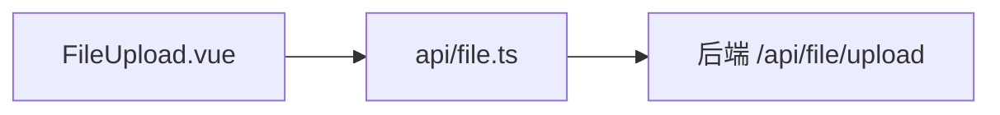

# Step2 Plan: 文件上传组件

## 任务目标

开发独立可复用的 `FileUpload.vue` 组件，支持 PDF/Word 上传、校验、解析调用

## 组件架构




## 实现步骤

### 1. 创建 API 封装 - `packages/frontend/src/api/file.ts`

```typescript
export interface FileUploadResult {
  filename: string;
  content: string;
}

export interface UploadError {
  type: 'size' | 'type' | 'network' | 'server';
  message: string;
}

export function uploadFile(file: File): Promise<FileUploadResult>
```

### 2. 创建 FileUpload.vue 组件 - `packages/frontend/src/components/FileUpload.vue`

**功能要求：**

- Vue3 Composition API + TS
- 支持选择/拖拽上传
- 文件类型校验：仅允许 `.pdf`、`.docx`
- 文件大小校验：≤10MB
- 进度条显示
- 成功/失败状态图标
- emit 上传结果给父组件

**类型定义：**

```typescript
interface UploadState {
  status: 'idle' | 'uploading' | 'success' | 'error';
  progress: number;
  error?: string;
}

interface FileUploadEmits {
  (e: 'success', data: { filename: string; content: string }): void;
  (e: 'error', error: UploadError): void;
}
```

### 3. 单元测试 - `packages/frontend/src/__tests__/FileUpload.test.ts`

测试用例：

- TC-FILE-001: 上传合法 PDF 文件
- TC-FILE-002: 上传合法 DOCX 文件
- TC-FILE-003: 上传非法类型文件（拒绝）
- TC-FILE-004: 上传超大文件（>10MB，拒绝）
- TC-FILE-005: 网络错误处理
- TC-FILE-006: emit 事件验证

## 验收标准

- 仅接受 `.pdf` 和 `.docx` 文件
- 文件大小 >10MB 时拒绝并提示
- 上传进度实时显示
- 成功/失败显示对应图标
- 解析结果通过 emit 传递给父组件
- 所有单元测试通过

