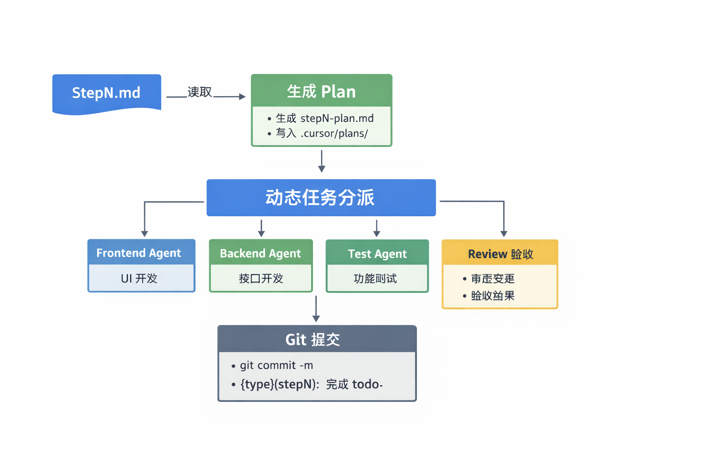

# 你的使用方式（关键）



🚀 一键运行

```bash

/run-all step1

```

👉 AI 自动：

- 生成 plan
- 分工执行
- 写代码
- 测试
- 审查

🧪 调试模式
/planner step1
/frontend step1
/backend step1
/test step1
/reviewer step1

🎯 最终你会变成什么

你现在是：

👉 👨‍💻 写代码的人

升级后你是：

👉 🧠 AI 团队负责人（只写 step）

🧠 一句话总结

你现在拥有的是：

Step 驱动开发 + 多 Agent 自动执行 + 自验证闭环系统
